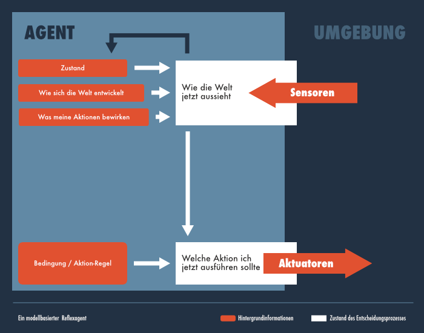

# AI Graphics
AI concepts graphics

## de_DE

### Einfacher Reflexagent

* [png](https://github.com/marcbreitung/ai-graphics/blob/master/de_DE/png/einfacher_reflexagent.png)
* [svg](https://github.com/marcbreitung/ai-graphics/blob/master/de_DE/svg/einfacher_reflexagent.svg)
* [Affinity](https://github.com/marcbreitung/ai-graphics/blob/master/de_DE/affinity/einfacher_reflexagent.afdesign)

### Modellbasierter Reflexagent

* [png](https://github.com/marcbreitung/ai-graphics/blob/master/de_DE/png/modellbasierter_reflexagent.png)
* [svg](https://github.com/marcbreitung/ai-graphics/blob/master/de_DE/svg/modellbasierter_reflexagent.svg)
* [Affinity](https://github.com/marcbreitung/ai-graphics/blob/master/de_DE/affinity/modellbasierter_reflexagent.afdesign)

### Nutzenbasierter Agent

* [png](https://github.com/marcbreitung/ai-graphics/blob/master/de_DE/png/nutzenbasierter_agent.png)
* [svg](https://github.com/marcbreitung/ai-graphics/blob/master/de_DE/svg/nutzenbasierter_agent.svg)
* [Affinity](https://github.com/marcbreitung/ai-graphics/blob/master/de_DE/affinity/nutzenbasierter_agent.afdesign)

### Zielbasierter Agent

* [png](https://github.com/marcbreitung/ai-graphics/blob/master/de_DE/png/zielbasierter_agent.png)
* [svg](https://github.com/marcbreitung/ai-graphics/blob/master/de_DE/svg/zielbasierter_agent.svg)
* [Affinity](https://github.com/marcbreitung/ai-graphics/blob/master/de_DE/affinity/zielbasierter_agent.afdesign)

### Problem Suche

* [png](https://github.com/marcbreitung/ai-graphics/blob/master/de_DE/png/problem_suche.png)
* [svg](https://github.com/marcbreitung/ai-graphics/blob/master/de_DE/svg/problem_suche.svg)
* [Affinity](https://github.com/marcbreitung/ai-graphics/blob/master/de_DE/affinity/problem_suche.afdesign)